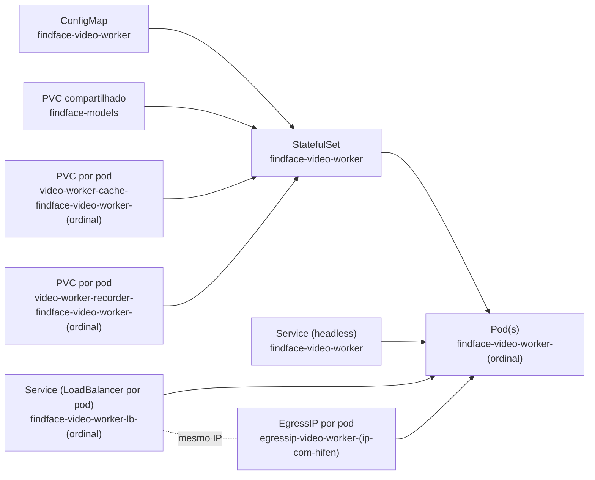
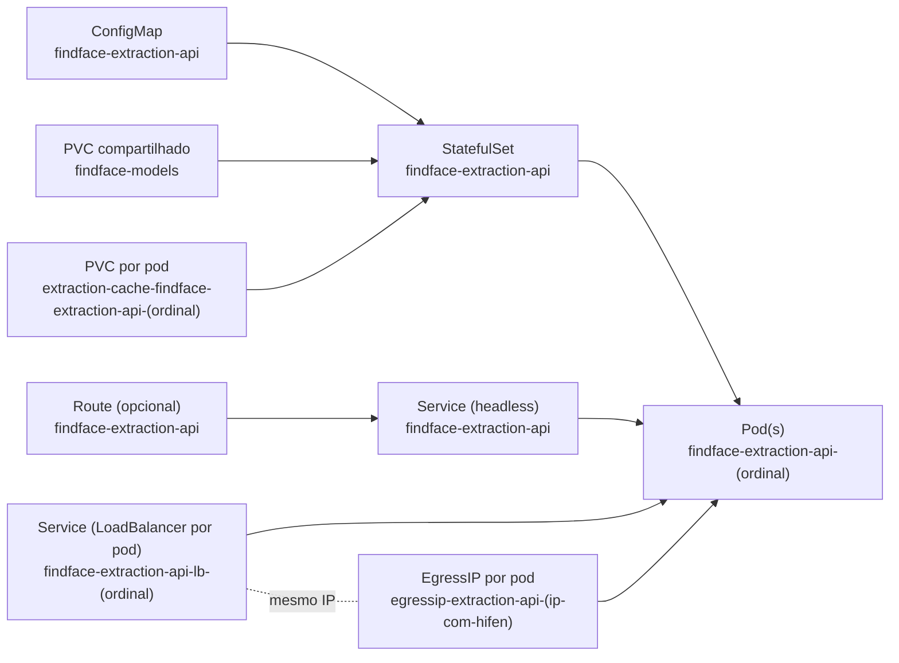

# FindFace Helm Chart - Manual de Deploy

Este chart implementa o recorte analisado do ambiente exportado:

- `findface-extraction-api` (escalavel via `extractionApi.replicaCount`)
- `findface-video-worker` (escalavel via `videoWorker.replicaCount`)

Dependencias externas permanecem fora do chart:

- NTLS (`externalDependencies.ntlsAddress`)
- Video Manager RPC (`externalDependencies.videoManagerRpcAddress`)
- Video Storage URL (`externalDependencies.videoStorageUrl`)

## Estrutura do chart

```text
charts/findface/
  Chart.yaml
  values.yaml
  argocd-application-findface-hml.yaml
  templates/
    extraction-api/
      configmap.yaml
      statefulset.yaml
      service.yaml
      service-loadbalancers.yaml
      egressip.yaml
      route.yaml
    video-worker/
      configmap.yaml
      statefulset.yaml
      service.yaml
      service-loadbalancers.yaml
      egressip.yaml
    models-loader/
      pod.yaml
    pvc-models.yaml
    NOTES.txt
```

## Pre-requisitos

- Kubernetes 1.24+ ou OpenShift 4.x
- Helm 3.x
- Classe de storage disponivel para PVCs
- Acesso de rede dos pods para:
  - NTLS
  - Video Manager RPC
  - Video Storage
- Se usar GPU:
  - Device plugin NVIDIA ativo no cluster
  - Nodes com GPU e rotulo/afinidade conforme sua politica
- Se imagens privadas exigirem autenticacao:
  - Secret de pull criado no namespace
- Para deploy via OpenShift GitOps:
  - Operador OpenShift GitOps instalado
  - Namespace padrao do Argo CD: `openshift-gitops`

## Valores principais (values)

Arquivo padrao: `charts/findface/values.yaml`

Campos mais importantes:

- `externalDependencies.ntlsAddress`
- `externalDependencies.videoManagerRpcAddress`
- `externalDependencies.videoStorageUrl`
- `imagePullSecrets`
- `models.pvc.*`
- `models.loader.*`
- `extractionApi.*`
- `extractionApi.service.loadBalancer.*`
- `extractionApi.egressIP.enabled`
- `videoWorker.*`
- `videoWorker.service.loadBalancer.*`
- `videoWorker.egressIP.enabled`
- `route.extractionApi.*` (OpenShift)

## Exemplo de values para ambiente

Crie um arquivo `values-prod.yaml`:

```yaml
imagePullSecrets:
  - regcred

externalDependencies:
  ntlsAddress: "10.32.200.19:3133"
  videoManagerRpcAddress: "10.32.200.19:18811"
  videoStorageUrl: "http://video-storage.svc.cluster.local:18611"

models:
  pvc:
    storageClassName: "ocs-storagecluster-ceph-rbd"
    size: 20Gi

extractionApi:
  replicaCount: 1
  gpu:
    enabled: true
    count: 1
  service:
    port: 18701
    loadBalancer:
      enabled: true
      addressPool: "pool-vlan70"
      loadBalancerIPs:
        - "10.32.200.40"
  egressIP:
    enabled: true
  cache:
    pvc:
      storageClassName: "ocs-storagecluster-ceph-rbd"
      size: 5Gi

videoWorker:
  replicaCount: 2
  cudaVisibleDevices: "0"
  gpu:
    enabled: true
    count: 1
  service:
    port: 19001
    loadBalancer:
      enabled: true
      addressPool: "pool-vlan70"
      loadBalancerIPs:
        - "10.32.200.41"
        - "10.32.200.42"
  egressIP:
    enabled: true
  cache:
    pvc:
      storageClassName: "ocs-storagecluster-ceph-rbd"
      size: 5Gi
  recorder:
    pvc:
      storageClassName: "ocs-storagecluster-ceph-rbd"
      size: 20Gi
```

Regras importantes:

- `extractionApi.service.loadBalancer.loadBalancerIPs` precisa ter **o mesmo numero de itens** de `extractionApi.replicaCount`.
- `videoWorker.service.loadBalancer.loadBalancerIPs` precisa ter **o mesmo numero de itens** de `videoWorker.replicaCount`.
- `extractionApi.service.loadBalancer.addressPool` e `videoWorker.service.loadBalancer.addressPool` definem o pool do MetalLB por componente.
- Em cada componente, os mesmos IPs sao usados para criar os recursos `EgressIP` por pod.
- O `namespaceSelector` dos recursos `EgressIP` e automatico: `kubernetes.io/metadata.name: <namespace do release Helm>`.

## Deploy (OpenShift)

### 1) Criar projeto/namespace

```bash
oc new-project findface-hml
```

Ou, em Kubernetes:

```bash
kubectl create namespace findface-hml
```

### 2) (Opcional) criar pull secret para registry privado

```bash
oc -n findface-hml create secret docker-registry regcred \
  --docker-server=docker.int.ntl \
  --docker-username='<usuario>' \
  --docker-password='<senha>' \
  --docker-email='<email>'
```

### 3) Validar chart antes de aplicar

```bash
helm lint ./charts/findface
helm template findface ./charts/findface -n findface-hml -f values-prod.yaml
```

### 4) Instalar/atualizar release

```bash
helm upgrade --install findface ./charts/findface \
  -n findface-hml \
  -f values-prod.yaml
```

### 5) (Opcional) habilitar Route para extraction-api

No `values-prod.yaml`:

```yaml
route:
  extractionApi:
    enabled: true
    host: "extraction-api.apps.seu-cluster.exemplo"
```

Ou por linha de comando:

```bash
helm upgrade --install findface ./charts/findface \
  -n findface-hml \
  -f values-prod.yaml \
  --set route.extractionApi.enabled=true \
  --set route.extractionApi.host=extraction-api.apps.seu-cluster.exemplo
```

## Deploy via OpenShift GitOps (Argo CD)

Este repositorio inclui uma `Application` pronta para homologacao:

- `charts/findface/argocd-application-findface-hml.yaml`

Namespaces padrao usados neste fluxo:

- `openshift-gitops`: namespace do Argo CD (OpenShift GitOps)
- `findface-hml`: namespace de destino da aplicacao

### 1) Ajustar o repositório Git no manifesto

Edite o campo `spec.source.repoURL` em `charts/findface/argocd-application-findface-hml.yaml` para o URL real do seu repositório.

Se necessario, ajuste tambem:

- `spec.source.targetRevision` (ex.: `main`)
- `spec.source.path` (atualmente `charts/findface`)

### 2) Aplicar a Application no namespace do OpenShift GitOps

```bash
oc apply -f charts/findface/argocd-application-findface-hml.yaml -n openshift-gitops
```

Observacoes:

- O manifesto usa `syncOptions: [CreateNamespace=true]`, entao o `findface-hml` pode ser criado automaticamente.
- A `Application` esta com `syncPolicy.automated` habilitada (`prune` e `selfHeal`).

### 3) Acompanhar sincronizacao

```bash
oc -n openshift-gitops get applications.argoproj.io
oc -n openshift-gitops describe application findface-hml
```

### 4) Verificar recursos no namespace de destino

```bash
oc -n findface-hml get pods
oc -n findface-hml get statefulset
oc -n findface-hml get pvc
oc -n findface-hml get svc
oc -n findface-hml get route
oc get egressip
```

## Topologia por pod (StatefulSet + IP dedicado)

`extraction-api` e `video-worker` seguem o mesmo padrao:

- StatefulSet por componente
- Service headless para identidade de pod
- Service `LoadBalancer` por pod, com IP fixo vindo de `values.yaml`
- IP/pool do MetalLB por Service via anotacoes (`metallb.io/loadBalancerIPs` e `metallb.io/address-pool`)
- Recurso `EgressIP` por pod, usando o mesmo IP do Service correspondente

Detalhes por componente:

- `extraction-api`
  - StatefulSet: `findface-extraction-api`
  - Pod: `findface-extraction-api-0`, `-1`, `-2`, ...
  - PVC por pod: `extraction-cache-findface-extraction-api-<ordinal>`
  - Service LoadBalancer por pod: `findface-extraction-api-lb-<ordinal>`
  - EgressIP por pod: `egressip-extraction-api-<ip-com-hifen>`
- `video-worker`
  - StatefulSet: `findface-video-worker`
  - Pod: `findface-video-worker-0`, `-1`, `-2`, ...
  - PVCs por pod: `video-worker-cache-findface-video-worker-<ordinal>` e `video-worker-recorder-findface-video-worker-<ordinal>`
  - Service LoadBalancer por pod: `findface-video-worker-lb-<ordinal>`
  - EgressIP por pod: `egressip-video-worker-<ip-com-hifen>`

### Diagrama Mermaid - video-worker



### Diagrama Mermaid - extraction-api



## Bootstrap dos models no PVC (oc rsync)

Se o worker subir com erro como:

- `failed to open file /usr/share/findface-data/models/...`
- `failed to initialize models`

isso indica que o PVC de models foi montado, mas ainda esta vazio.

O chart inclui um pod auxiliar opcional (`models-loader`) para popular esse PVC.

### Opcao A: usando Helm diretamente

1) Habilitar o loader:

```bash
helm upgrade --install findface ./charts/findface \
  -n findface-hml \
  -f values-prod.yaml \
  --set models.loader.enabled=true
```

2) Esperar o pod ficar `Running`:

```bash
oc -n findface-hml get pod findface-models-loader -w
```

3) Copiar os models para o PVC montado:

```bash
oc -n findface-hml rsync ./opt-server-export/models/ \
  findface-models-loader:/usr/share/findface-data/models/
```

4) Desabilitar o loader:

```bash
helm upgrade --install findface ./charts/findface \
  -n findface-hml \
  -f values-prod.yaml \
  --set models.loader.enabled=false
```

### Opcao B: usando OpenShift GitOps (Argo CD)

1) No arquivo de values usado pela Application, ajustar:

```yaml
models:
  loader:
    enabled: true
```

2) Sincronizar a Application no Argo CD.

3) Executar o `oc rsync` igual ao passo acima.

4) Depois de copiar os models, voltar `models.loader.enabled` para `false` e sincronizar novamente.

### Verificacao rapida

```bash
oc -n findface-hml exec findface-video-worker-0 -- \
  ls -lah /usr/share/findface-data/models/detector
```

Se os arquivos `.fnk` esperados aparecerem, reinicie o worker:

```bash
oc -n findface-hml rollout restart statefulset/findface-video-worker
```

## Verificacao pos-deploy

```bash
oc -n findface-hml get pods
oc -n findface-hml get pvc
oc -n findface-hml get svc
oc -n findface-hml get route
```

Conferir manifests renderizados do release aplicado:

```bash
helm get manifest findface -n findface-hml
```

## Upgrade, rollback e uninstall

Upgrade:

```bash
helm upgrade findface ./charts/findface -n findface-hml -f values-prod.yaml
```

Historico:

```bash
helm history findface -n findface-hml
```

Rollback:

```bash
helm rollback findface <REVISAO> -n findface-hml
```

Uninstall:

```bash
helm uninstall findface -n findface-hml
```

## Troubleshooting rapido

- Pods nao sobem por imagem:
  - Verifique `imagePullSecrets` e credenciais de registry.
- Pods nao sobem por GPU:
  - Verifique device plugin NVIDIA e capacidade de nodes.
  - Para erro `CUDA_ERROR_NO_DEVICE`, valide `videoWorker.cudaVisibleDevices`.
  - Em Kubernetes/OpenShift com `limits.nvidia.com/gpu: 1`, use preferencialmente `videoWorker.cudaVisibleDevices: "0"`.
- Falha de conexao com servicos externos:
  - Revise `externalDependencies.*` e politicas de rede.
- PVC pendente:
  - Revise `storageClassName`, quotas e capacidade do cluster.
- Erro no `helm template` sobre quantidade de IPs:
  - Garanta que `extractionApi.service.loadBalancer.loadBalancerIPs` tenha o mesmo tamanho de `extractionApi.replicaCount`.
  - Garanta que `videoWorker.service.loadBalancer.loadBalancerIPs` tenha o mesmo tamanho de `videoWorker.replicaCount`.
- Necessidade de `hostNetwork`:
  - O padrao esta `false`; habilite somente se validado no seu ambiente.

## Observacoes de escopo

- A topologia completa FindFace Multi nao esta integralmente modelada aqui.
- Antes de producao, valide dependencias externas, GPU, EgressIP e storage conforme sua infraestrutura.
